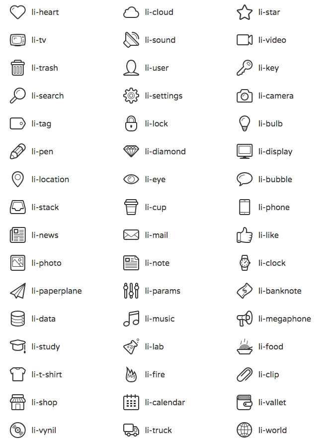

# Linecons Meteor Wrapper

**Table of contents**

- [About](#about)
- [Installation](#installation)
- [Usage](#usage)

## About

[Linecons](https://dribbble.com/shots/927536-Linecons-48-outline-icons) wrapper for [Meteor](http://meteor.com).

The package includes icon font and a css file.


## Installation

```sh
meteor add shcherbin:linecons
```

## Usage

Choose the icon and add a class with its name.

```html
<i class="li-heart"></i>
```

**Icon Class Names**

